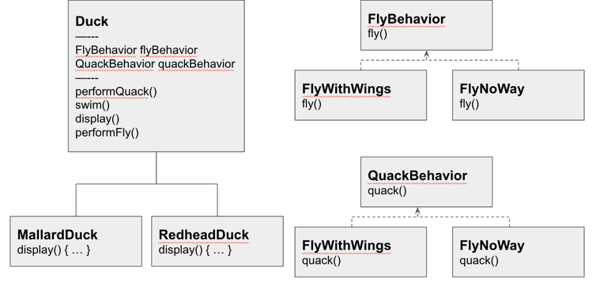
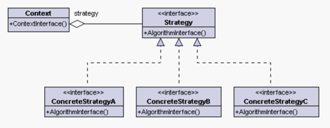

#### 디자인 패턴의 세계로 떠나기 (전략패턴)

- 오리 시뮬레이션 게임 SimUDuck
  
  - 해당 구조에서 오리에 대한 날기 기능 추가 결정
      - Duck 클래스에 fly() 메서드를 추가하여 해결
      - 문제 발생, Duck 클래스를 상속받는 신규 오리 캐릭터(고무 오리)에서도 원치 않는 fly 기능이 추가
      - 고무오리 클래스에 fly() 메서드를 오버라이드하여 아무런 기능이 없도록 수정?! -
          - 추가되는 캐릭터에 모두 똑같은 방법으로 해결하기엔 어려움이 있음

  - 상속을 생각할 때 발생할 수 있는 문제점
      - 서브클래스에 코드가 중복된다.
      - 모든 오리의 행동을 알기 어렵다
      - 실행 시에 특징을 바꾸기 힘들다
      - 코드를 변경했을 때 다른 오리들에게 원치 않은 영향을 끼칠수 있다.

  - 인터페이스 설계
      - 서브클래스에서 Flyable, Quackable 을 구현하여 일부 문제점을 해결할 수 있다.

  - 문제 명확하게 파악하기
    
      - 디자인 원칙: 애플리케이션에서 달라지는 부분을 찾아내고 달라지지 않는 부분과 분리한다.
          - 바뀌는 부분은 따로 뽑아서 캡슐화한다. 나중에 바뀌지 않는 부분에는 영향을 미치지 않고 그 부분만 고치거나 확장할 수 있다.
      - 변경 가능한 fly(), quack() 메서드 캡슐화
          - FlyBehavior, QuackBehavior 인터페이스 사용
          - 구체적으로 행동하는 클래스 구현
      - 행동 통합
          - Duck 클래스에 FlyBehavior, QuackBehavior을 변수로 선언하여 행동 메서드 추가
      - 동적으로 행동 지정하기
          - setter, constructor 등을 활용하여 필요한 변수 세팅하여 사용

- 두 클래스 합치기
  - 구성(Composition): A에는 B가 있다.
  - 각 오리에 FlyBehavior, QuackBehavior 가 있으며 오리에게 행동을 위임 받는다.
  - 상속보다는 구성 활용
  
- 전략 패턴 (Strategy Pattern)
  

  - 객체들이 할 수 있는 행위 각각에 대해 전략 클래스를 생성
  - 유사한 행위들을 캡슐화 하는 인터페이스를 정의
  - 객체의 행위를 동적으로 바꾸고 싶은 경우 직접 행위를 수정하지 않고 전략을 바꿔주기만 함으로써 행위를 유연하게 확장하는 방법
    - 객체가 할 수 있는 행위들 각각을 전략으로 만든다. 
    - 동적으로 행위의 수정이 필요한 경우 전략을 바꾸는 것만으로 행위의 수정이 가능하도록 만든 패턴
  - 전략패턴은 알고리즘군을 정의하고 캡슐화하여 각각의 알고리즘군을 수정해서 쓸 수 있게 해준다.
    - 전략패턴을 사용하면 클라이언트로부터 알고리즘을 분리해 독립적으로 변경할 수 있다.

#### 추가되는 객체 지향 원칙

- 바뀌는 부분은 캡슐화한다
- 상속보다는 구성을 활용한다
- 구현보다는 인터페이스에 맞추어 프로그래밍한다.

