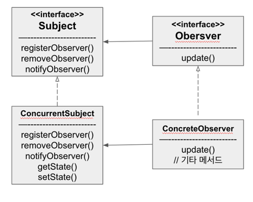
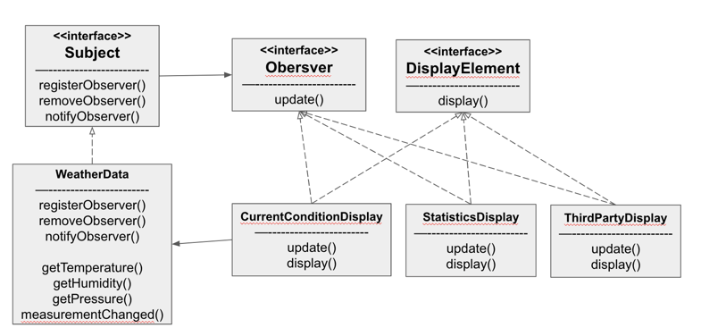

#### 옵저버 패턴 - 객체들에게 연락돌리기

##### 예제 - 가상 모니터링 애플리케이션

- 시스템 구성요소 3가지
  - 기상 스테이션
  - WeatherData 객체
  - 사용자에게 보여주는 디스플레이 장비
- WeatherData 객체는 현재 조건, 기상 통계, 기상 예보에 대한 내용을 디스플레이 장비에서 갱신해 가면서 보여주는 애플리케이션

- WeatherData 클래스
  - getTemperature(), getHumidity(), getPressure()
    - 가장 최근에 측정된 기상 스테이션에서 값을 가져오는 메서드
  - measurementChanged()
    - 갱신된 값을 가져오면 해당 메서드가 호출되어 디스플레이에 갱신된 정보를 보여준다

- 추가 목표: 확장성
  - 디스플레이에 새로운 요소가 추가되거나 빠질 수 도 있다.
  
  ```java
  public void measurementChanged() {
      float temperature = getTemperature();
      float humidity = getHumidity();
      float pressure = getPressure();
      
      // 변경 가능한 부분으로 캡슐화 필요
      currentConditionDisplay.update(temperature, humidity, pressure);
      statisticsDisplay.update(temperature, humidity, pressure); 
      forecastDisplay.update(temperature, humidity, pressure);
  }
  ```
  - 구체적인 구현에 맞추어 개발했으므로 프로그램을 고치지 않고 다른 디스플레이 항목을 추가하거나 제어할 수 없다.
  - update 메서드는 데이터를 주고받을 때 공통된 인터페이스를 사용한다 

#### 옵저버 패턴

- 패턴 원리
  - Subject 는 Observer 를 관리한다.
    - Observer 를 등록하거나 뺄 수 있다.
  - Subject 에 데이터가 들어오면 관리중인 Observer 에게 일괄적으로 데이터를 전송한다. 

- 패턴 정의
  

  - 객체의 상태가 바뀌면 그 객체에 의존하는 다른 객체에게 연락을 하고 자동으로 내용이 갱신되는 일대다 방식의 의존성 정의
    - one-to-many
  - 옵저버 패턴의 느슨한 결합력(Loose Coupling)
    - Subject 는 ConcreteObserver 가 특정 인터페이스(Observer)를 구현한다는 것만 알 고 있다.
    - 옵저버는 언제든 새로 추가할 수 있다.
    - 새로운 형식의 옵저버를 추가하더라도 주제를 변경할 필요가 없다.
    - 주제와 옵저버는 서로 독립적으로 재사용할 수 있다.
    - 주제나 옵저버가 달라져도 서로에게 영향을 미치지 않는다

#### 옵저버 패턴을 적용한 WeatherData



#### 추가되는 객체 지향 원칙

- 상호작용하는 객체 사이에서는 가능하면 느슨한 결합을 사용하자
