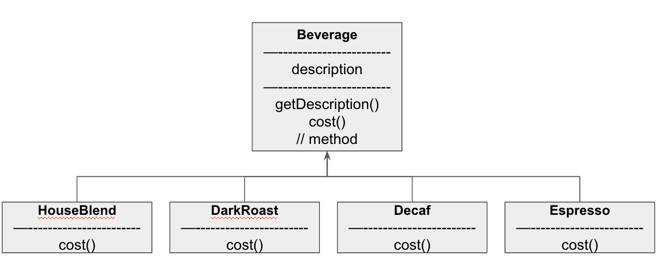
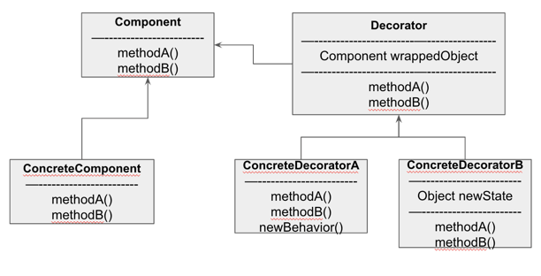

#### 데코레이터 패턴 - 객체 꾸미기

##### 에시 - 스타버즈

- 다양한 음료를 포괄하는 주문 시스템 개선
  - AS-IS
    
    - 문제점 인식: 메뉴가 늘어갈 수록 클래스를 추가하여야 한다.
    - 만약 인스턴스 변수와 슈퍼클래스 상속을 써서 첨가물 관리한다면?
      ```
      Beverage
      -------
      description
      milk
      soy
      mocha
      whip
      --------
      getDescription()
      cost()
      
      hasMilk()
      setMilk()
      // ...
      ```
      - if(hasMilk()) totalCost += milkCost;
      - 첨가물 가격이 바뀔 때마다 소스를 변경해야 하며, 첨가물의 종류가 추가되면 소스 수정이 필요하다.

- OCP 살펴보기
  - 디자인 원칙: 클래스는 확장에는 열려 있어야 하지만 변경에는 닫혀 있어야 한다.
  - 기존 코드를 건드리지 않고 확장으로 새로운 행동을 추가하는 것

- 데코레이터 패턴 살펴보기
  - 특정 음료에 첨가물을 장식으로 생각
  - DarkRoast 객체에서 시작한다 (DarkRoast는 Beverage 로 부터 상속ㄱ받으므로 음료의 가격을 계산하는 메서드가 있다.)
  - 고객이 모카를 추가하면 Mocha 객체를 만들고 그 객체로 DarkRoast를 감싼다
  - 고객이 휘핑크림을 추가하면 Whip 데코레이터를 만들어 Mocha를 감싼다.
  - 가격을 구하면 Whip에 cost를 호출한다. 내부에 있는 Mocha, DarkRoast가 호출되며 계산된 값이 리턴된다

##### 데코레이터 패턴

- 데코레이터 패턴으로 객체에 추가 요소를 동적으로 더할 수 있다.
  - 데코레이터를 사용하면 서브클래스를 만들때 보다 훨씬 유연하게 기능을 확장할 수 있다.

 
- 데코레이터 안에는 Component 객체가 들어 있다
  - 데코레이터에는 구성 요소의 레퍼런스를 포함한 인스턴스 변수가 있다.
  - Decorator는 Component의 상태를 확장할 수 있다.

- 데코레이터 패턴을 사용하면 객체에 추가 요소를 동적으로 더할 수 있다.
  - 서브클래스를 만들어 사용하는 것보다 유연하게 기능을 확장할 수 있다.

##### 데코레이터 패턴 적용

```java
Beverage beverage = new Espresso();
System.out.println(beverage.getDescription() +" " + beverage.cost()); 
// Espresso 0.98

Beverage beverage1 = new HouseBlend();
beverage1 = new Mocha(beverage1);
beverage1 = new Whip(beverage1);
beverage1 = new Whip(beverage1);
System.out.println(beverage1.getDescription() +" " + beverage1.cost());
// HouseBlend, Mocha, Whip, Whip 4.2
```

##### 데코레이터 적용 예: 자바 IO

- InputStream은 추상 데코레이터 클래스 역할
  - BufferedInpustStream과 ZipInputStream은 둘 다 FilterInputStream 을 확장한 클래스
- 단점으로는 너무 많은 클래스가 생성된다.

- 예시
  ```java
  public class LowerCaseInputStream extends FilterInputStream {
      public LowerCaseInputStream(InputStream in) {
          super(in);
      }
      
      public int read() throws IOException {
          int c = in.read();
          return ( c == -1 ? c : Character.toLowerCase((char)c));
      }
      
      public int read(byte[] b, int offset, int len) throws IOException {
          int result = in.read(b, offset, len);
          for(int i = offset; i < offset + result; i++) {
              b[i] = (byte)Character.toLowerCase((char)b[i]);
          }
          return result;
      }
  }
  ```