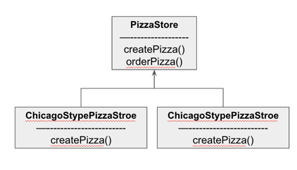
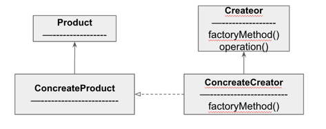
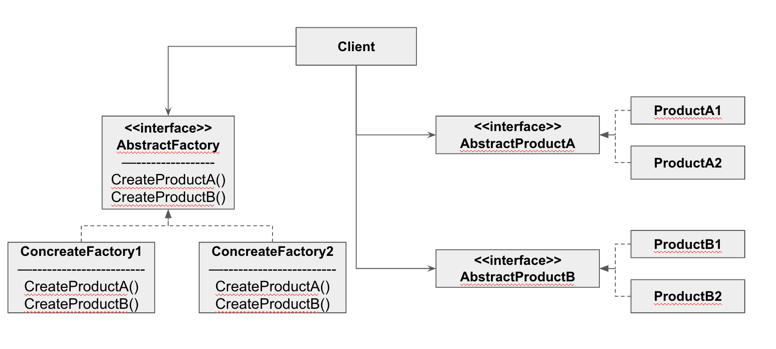

#### 팩토리 패턴 - 객체지향 빵 굽기

##### 예제 - 피자 코드 만들기

- new 연산자
  - new 를 사용하면 구상 클래스의 인스턴스가 만들어진다
  - 구상 클래스를 바탕으로 코딩하면 나중에 코드를 수정해야 할 가능성이 커지고, 유연성이 떨어진다

- new 연산자의 문제
  - new 는 문제가 없다
  - 다만, '변화' 하는 무언가 떄문에 new 를 조심해서 사용해야 한다.
  - 다형성
    - 인터페이스를 바탕으로 만들어진 코드는 어떤 클래스든 특정 인터페이스만 구현하면 사용할 수 있다.
    - 반대로 구상클래스가 추가될 떄마다 코드를 변경해야 하므로 문제가 생길 가능성이 높아진다.
    - OCP 위반

- 최첨단 피자 만들기
  ```java
  public Pizza orderPizza(String type) {
        Pizza pizza;
        if("cheese".equals(type)) {
            pizza = new CheesePizza();
        } else if("greek".equals(type)) {
            pizza = new GreekPizza();
        } else if("peperoni".equals(type)) {    
            pizza = new PeperoniPizza();
        }
        
        pizza.prepare();
        pizza.break();
        pizza.cut();
        pizza.box();
        return pizza;
  }
  ```
  - 이렇게 피자를 만드는 코드가 있다
  - 피자에 종류가 추가되면 type 분기가 추가되어야 한다.

- 객체 생성 부분 캡슐화
  - 팩토리를 만들어 객체 생성 부분을 전담할 클래스를 정의하면 된다
    - SimplePizzaFactory
  - 만약, 각 지점마다 해당 지역에 맞는 다양한 스타일의 피잘르 만들어야 한다면
    - SimplePizzaFactory 대신, NYPizzaFactory, ChicagoPizzaFactory를 생성하여 다르게 관리
    - 이런 경우, 각 지점별로 관리하기 어려워 진다
  - PizzaStore 와 피자 제작 코드 전체를 하나로 묶어주는 프레임워크를 만들어야 한다

- 피자 가게 프레임워크 만들기 (팩토리 메서드)
  
  - orderPizza에서 prepare, break, cut, box 를 정의한다
  - createPizza를 통해 Pizza 종류를 선택할 수 있도록 한다
    - PizzaStore를 상속받는 NYPizzaStore, ChicagoStypePizzaStore 에서는 해당 지역에 맞는 다양한 스타일 피자를 만드는 createPizza()를 구현한다

##### 팩터리 메서드 패턴 정의



- 모든 팩터리 패턴은 객체 생성을 캡슐화한다.
- 팩터리 메서드 패턴은 서브 클래스에서 어떤 클래스를 만들지 결정함으로써 객체 생성을 캡슐화한다.
- 객체를 생성할 필요한 인터페이스를 만든다.
  - 어떤 클래스의 인스턴스를 만들 지 서브클래스에서 결정
  - 팩터리 메서드 패턴을 사용하면 클래스 인스턴스 만드는 일을 서브클래스에 맡기게 된다.

- DIP
  - 의존성 역전 원칙
  - 추상화된 것에 의존하게 만들고, 구상 클래스에 의존하지 않게 만든다
    - '고수준' 구성 요소는 다른 '저수준' 구성 요소에 의해 정의되는 행동이 들어있는 구성 요소를 뜻한다.
  - 팩터리 메서드 패턴을 적용하면 고수준 구성요소인 PizzaFactory 와 저수준 구성요소인 Pizza 객체 모두가 추상 클래스인 Pizza 에 의존하는 것을 알 수 있다.
    - PizzaStore 의 행동은 피자에 의해 정의되므로 고수준 구성요소
    - PizzaStore 에서 사용하는 Pizza 객체는 저수준 구성요소가 된다.
    - PizzaStore 는 추상클래스인 Pizza 클래스만 의존하게 된다.
    - 구성 피자 클래스도 추상화된 Pizza 추상 클래스에 의존한다
  - DIP 원칙 지키는 방법(지향해야 할 방식)
    - 변수에 구상 클래스의 레퍼런스를 저장하지 말아야 한다.
    - 구상 클래스에서 유도된 클래스를 만들지 않는다.
    - 베이스 클래스에 이미 구현되어 있는 메서드를 오버라이드하지 말아야 한다.

##### 예제 - 원재료 품질을 관리하는 피자코드

- 원재료 품질 관리 방법
  - 원재료를 생산하는 공장을 만들고 지점까지 재료 배달
  - 뉴욕과 시카고에서 사용하는 재료가 다르기 때문에 원재료군을 처리할 방법을 생각해 보자

  - 원재료 팩토리 만들기
    - 원재료를 생산하는 팩토리용 인터페이스 정의
      ```java
      public interface PizzaIngredientFactory {
          public Dough createDough();
          public Sauce createSouce();
          public Cheese createCheese();
          public Veggies[] createVeggies();
          public Peperoni createPeperoni();
          public Clams createClam();
      }
      ```
    - 지역별로 팩토리를 만든다. 각 생성 메소드를 구현하는 PizzaIngredientFactory 클래스
      
    - 팩토리에 사용할 원재료 클래스를 구현해야 한다
      - 상황에 따라 서로 다른 지역에서 같은 재료 클래스를 쓸 수 있다.
      ```java
      public class CheesePizza extends Pizza {
          PizzaIngredientFactory pizzaIngredientFactory;
          void prepare() {
              dough = pizzaIngredientFactory.createDough();
              // ...
          }
      }
      ```
    - 새로 만든 원재료 팩토리를 PizzaStore 코드에서 사용하도록 모든 것을 하나로 묶어야 한다
      ```java
      public class NYPizzaStore extends PizzaStore {
          protected Pizza createPizza(String item) {
              Pizza pizza = null;
              PizzaIngredientFactory = ingredientFactory = new NYPizzaIngredientFactory();
              if(item.equals("cheese")) {} else if(item.equals("veggie")) {} // ...
              return pizza;
          }
      }
      ```
      
##### 추상 팩토리 패턴 정의

- 추상 팩토리 패턴
  
  

  - 구상 클래스에 의존하지 않고 서로 연관되거나 의존적인 객체로 이뤄진 제품군을 생산하는 인터페이스를 제공
  - 구상클래스는 서브 클래스에서 만든다
    - 클라이언트를 만들때는 추상 팩토리를 바탕으로 만든다.(AbstractFactory)
    - AbstractFactory는 모든 구상 팩토리에서 구현해야하는 인터페이스, 제품을 생성할 때 사용하는 메서드 정의
    - 제품군, 각 구상 팩토리에서 필요한 제품을 모두 만들 수 있다

      