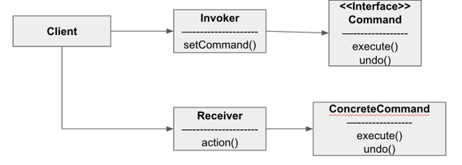

#### 커맨드 패턴 (호출 캡슐화하기)

##### 예제) 만능 IOT 리모컨

- 프로그래밍 가능한 7개의 슬롯과 ON/OFF 스위치
  - 슬롯에서 사용가능한 제품 모두 클래스로 생성 - EX) TV, Steroe, CeillingLight ... 
  - 해당 클래스에 ON/OFF 뿐만 아닌 기능에 대한 메소드 구현
  - 제품이 추가될 때마다, 클래스 추가 필요. 필요에 따라 여러 메서드 추가 필요, 리모컨에 있는 코드를 수정해야 한다.

- 커맨드 패턴 활용
  - 작업을 요청하는 쪽과 작업을 처리하는 쪽을 분리

##### 커맨드 패턴



- 클라이언트는 ConcreteCommand를 생성하고 Receiver를 설정
  - Invoker에는 명령이 들어있으며, execute() 메서드를 호출함으로써 커맨드 객체에게 특정 작업을 수행해 달라는 요구
  - Receiver는 요구 사항을 수행할 때 어떤 일을 처리해야 하는지 알고 있는 객체
  - Command 는 모든 커맨드 객체에서 구현해야 하는 인터페이스로 모든 명령은 execute() 메서드 호출로 수행
  - ConcreteCommand는 특정 행동과 리시버를 연결해 준다
    ```java
    public void execute() { receiver.action(); }
    ```

- 커맨드 패턴을 사용하면 요청 내역을 객체로 캡슐화해서 객체를 서로 다른 요청 내역에 따라 매개변수화할 수 있다.
  - 이러면 요청을 큐에 저장하거나 로그로 기록하거나 작업 취소 기능을 사용할 수 있다.

- 상태를 활용하여 커맨드에 execute를 수정할 수 있다.