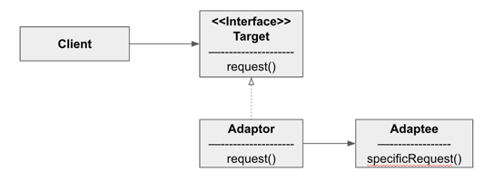
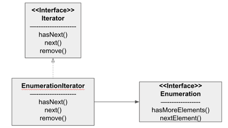
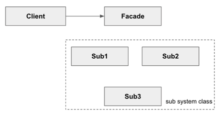

#### 어댑터 패턴

- 어댑터는 클라이언트로부터 요청을 받아 새로운 업체에서 제공하는 클래스를 클라이언트가 받아들일 수 있는 형태의 요청으로 변환해주는 중개인 역할
- 어댑터 사용 방법
  ```java
  public interface Duck {
      public void quack();
      public void fly();
  }
  public class MallardDuck implements Duck {
      public void quack() { System.out.println("Quack"); }
      public void fly() { System.out.println("Flying"); }
  }
  public interface Turkey {
      public void gobble();
      public void fly();
  }
  public class WildTurkey implements Turkey {
      public void gobble() { System.out.println("골골"); }
      public void fly() { System.out.println("짧게 날기");}
  }
  ```
  - 위와 같이 interface와 구현체가 있다면, Duck 객체 대신 Turkey 객체를 사용해야 하는 상황이라면 Tuckey 를 사용할 수 있는 Adaptor를 생성해야 한다
  ```java
  public class TurkeyAdaptor implements Duck {
      Turkey turkey;
      public TurkeyAdaptor(Turkey turkey) { this.turkey = turkey; }
      public void quack() { turkey.gobble(); }
      public void fly() { for(int i = 0; i < 5; i++) { turkey.fly(); }
  }
  ```

- 어댑터 패턴 정의
  
  
  - 특정 클래스 인터페이스를 클라이언트에서 요구하는 다른 인터페이스로 변환
  - 인터페이스가 호환되지 않아 같이 쓸 수 없었던 클래스를 사용할 수 있게 도와준다
  - 클라이언트는 타겟 인터페이스만 바라본다. 어댑터에서 타깃 인터페이스를 구현하며 모든 요청은 어댑티에 위임된다.

- 클래스 어댑터
  - 클래스 어댑터를 사용하기 위해서는 다중 상속이 필요한데, 자바에서는 다중 상속이 불가능하다
  
- 어댑터 패턴에 실전 적용
  - Enumeration: 초기 컬렉션 형식에서 Enumeration을 사용하여 컬렉션의 각 항목을 접근하도록 했다.
  - Iterator: 컬렉션에 있는 항목을 접근하고 제거할 수 있게 해주는 Iterator Interface
  - Iterator vs Enumeration
    - 구형은 Enumeration, 최근 코드는 Iterator를 사용하였기 때문에 어댑터 패턴을 활용하였다.
      

#### 퍼사드(Facade: 겉모양이나 외관) 패턴

##### 예제) 홈시어터

- 영화를 보기 까지의 과정
  - 팝콘 기계를 킨다 -> 팜콘을 뒤킨다 -> 조명을 조절한다 -> 스크린을 내린다 -> 프로젝터를 켠다 ...
  - 복잡한 일을 퍼사드 패턴으로 간단하게 처리할 수 있다.

- 퍼사드 작동 원리
  - 쓰기쉬운 인터페이스를 제공하는 퍼사드 클래스를 구현함으로써 훨씬 편리하게 사용할 수 있다.
  - HomeTeaterFacade.watchMovie() 를 클라이언트가 실행하면
    - 팝콘 기계, 조명, 스크린, 프로젝터 등 클래스에 메서드가 실행될 수 있도록 해준다
  - 퍼사드는 인터페이스를 단순하게 만드는 용도로 쓰이는 반면, 어댑터는 인터페이스를 다른 인터페이스로 변환하는 용도로 사용
  ```java
  public class HomeTheaterFacade {
      Amplifier amp;
      Tuner tuner;
      StreamingPlayer player;
      Projector projector;
      TheaterLights lights;
      Screen screen;
      PopcornPopper popper;
      
      public void watchMovie(String movie) {
          System.out.println("영화 볼 준비 중");
          popper.on(); popper.pop();
          lights.dim(10);
          screen.down();
          projector.on(); projector.wideScreenMode();
          amp.on(); amp.setStreamingPlayer(player); amp.setSurroundSound(); amp.setVolume(5);
          player.on(); player.play(movie);
      }
      public void endMovie() {
          System.out.println("홈씨어터 끄는 중");
          popper.off();
          lights.on();
          screen.up();
          projector.off();
          amp.off();
          player.stop(); player.off();
      }
  }
  ```

##### 퍼사드 패턴의 정의



- 서브시스템에 있는 일련의 인터페이스를 통합 인터페이스로 묶어준다
- 또한, 고수준 인터페이스도 정의하여 서브시스템을 더 편리하게 사용할 수 있도록 한다

- 최소 지식 원칙
  - 객체 사이 상호작용은 될 수 있으면 아주 가까운 '친구' 사이에서만 허용하는 편이 좋다
  - 여러 클래스가 복잡하더라도 시스템을 고쳐야 할 때 다른 부분까지 고쳐야 하는 상황을 미리 방지할 수 있다
- 퍼사드 패턴과 최소 지식 원칙
  - 클라이언트의 친구는 퍼사드 하나 뿐이다.
  - 서브 클래스에 변경이 필요하거나 방식이 변경되더라도 클라이언트는 단순하며 유연해질 수 있다.
    