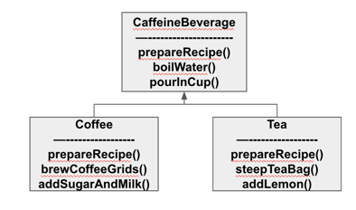
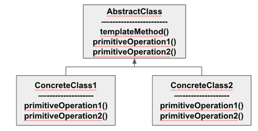

#### 알고리즘 캡슐화하기(템플릿 메소드 패턴)

##### 커피와 홍차 만들기

- 커피: 물을 끓인다 -> 끓는 물에 커피를 우려낸다 -> 커피를 컵에 따른다 -> 설탕과 우유를 추가한다
- 홍차: 물을 끓인다 -> 끓는 물에 찻잎을 우려낸다 -> 홍차를 컵에 따른다 -> 레몬을 추가한다
- 커피와 홍차를 만드는 데, 중복된 부분이 많다
  - 추상화하기
    
    
    - 추상화 방법 들여다보기
      - 제조법의 알고리즘이 비슷하다는 것을 알 수 있다.
        - 커피를 우려낸다 / 찻잎을 우려낸다 -> 우려낸다
        - 설탕, 우유를 추가한다 / 레몬을 추가한다 -> 첨가물을 추가한다
      - prepareRecipe() 메서드 추상화
        ```java
        final void prepareRecipe() {
            boilWater();
            brew();
            pourInCup();
            addCondiments();
        }
        abstract void brew();
        abstract void addCondiments();
        ```
        - Coffee 객체와 Tea 객체에서 brew, addCondiments 를 구현

- 템플릿 메소드 패턴 알아보기
  - 알고리즘의 각 단계를 정의하며, 서브클래스에서 일부 단계를 구현할 수 있도록 유도
  - 커피, 홍차 만들기에서 템플릿 메소드 패턴에 장점
    - CaffeineBeverage 클래스에서 작업 처리를 위한 알고리즘 독점
    - 서브클래스에서 코드 재사용하며 알고리즘에 한 부분을 수정하면 된다
    - 다른 음료도 쉽게 제작할 수 있는 템플릿을 제공

##### 템플릿 메소드 패턴 정의

- 알고리즘의 골격을 정의
- 템플릿 메서드를 사용하면 알고리즘의 일부 단계를 서브클래스에서 구현할 수 있으며, 알고리즘의 구조는 그대로 유지하면서 알고리즘의 특정 단계를 서브클래스에서 재정의할 수 있다.

  

- 템플릿 메소드 속 후크 알아보기
  - 후크는 추상 클래스에서 선언되어 있지만, 기본적인 내용만 구현되어 있어, 아무 코드도 들어있지 않은 메소드
  - 서브클래스는 다양한 위치에서 알고리즘에 끼어들 수 있다.
    ```java
    final void prepareRecipe() {
        //...
        if(customerWantsCondimets()) {
            addCondimetns();
        }
    }
    boolean customerWantsCondimets() {
        return true;
    }
    ```
    - 서브클래스는 해당 클래스를 상속받고, customerWantsCondimets() 를 오버라이딩 하면 원하는 조건을 수정할 수 있다