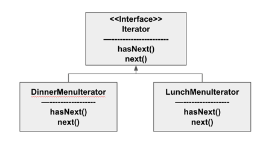
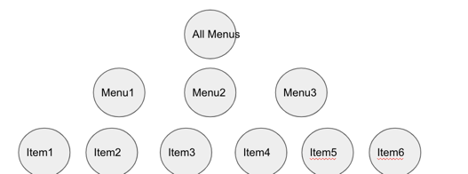
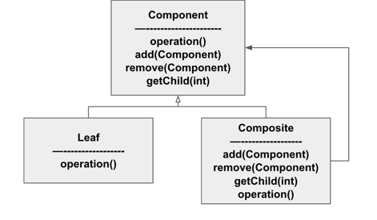

#### 컬렉션 잘 관리하기 (반복자 패턴과 컴포지트 패턴)

##### 예시) 객체마을 식당과 팬케이크 하우스 합병

- 아침에는 팬케이크 하우스 메뉴, 점심에는 객체마을 식당 메뉴 사용
  - MenuItem 객체
  - PancakeHouseMenu 객체: MenuItem 을 ArrayList 로 관리
  - DinerMenu 객체: MAX_ITEMS 를 잡고 MenuItem 을 배열로 관리

- 메뉴 구현 방식(배열, 리스트) 가 다르기 때문에 클라이언트를 따로 만들어주어야 한다
  - 종업원 객체 생성
    - printMenu(); printBreakfastMenu(); printLunchMenu();
    - printVegeterianMenu(); isVegiterian(String name);

- 반복 캡슐화하기
  - 리스트: size(), get() 메서드 사용, 배열: length 필드와 첨자 사용
  - 리스트, 배열에 대한 반복 작업 처리 방법을 캡슐화한 Iterator 라는 객체를 만들어 사용
    ```java
    Iterator breakfastIterator = breakfastMenu.createIterator();
    while(breakfastIterator.hasNext()) { MenuItem menuItem = breakfastIterator.next(); }
    
    Iterator lunchIterator = lunchMenu.createIterator();
    while(lunchIterator.hasNext()) { MenuItem menuItem = lunchIterator.next(); }
    ```

##### 반복자 패턴 (Iterator Pattern)
  

  
- 반복자 패턴이 Iterator 인터페이스에 의존한다.
- 해당 Iterator (배열, 리스트, 해시테이블) 가 있으면 모든 종류의 객체 컬렉션에 반복자를 구현할 수 있다.

- 반복자 패턴의 특징
  - 메뉴 구현법이 캡슐화되어 있다
  - 반복자만 구현하면 다형성을 활용해 어떤 컬렉션이든 1개의 순환문으로 처리할 수 있다

- java.util.Iterator 적용
  ```java
  public class DinerMenuIterator implements Iterator<MenuItem> {}
  ```
  
- 반복자 패턴은 컬렉션의 구현 방법을 노출하지 않으면서 집합체 내의 모든 항목에 접근하는 방법을 제공한다.

- 단일 역할 원칙(SRP)
  - 클래스에서 원래 그 클래스의 역할 외에 다른 역할을 처리할 때 2가지 이유로 그 클래스가 바뀔 수 있다는 사실을 알아야 한다
    - 컬렉션이 어떤 이유로 바뀌게 되면, 그 클래스도 바뀌어야 한다
    - 반복자 관련 기능이 바뀌었을 때도 클래스가 바뀌어야 한다
  - '변경' 과 관련된 디자인 원칙 : 어떤 클래스가 바뀌는 이유는 하나뿐이어야 한다
    - 코드를 변경해야 하는 이유가 2가지나 되면 그 만큼 클래스를 나중에 고쳐야 할 가능성이 커진다

##### Iterable 인터페이스와 향상된 for문

- 향상된 for 문
  ```java
  menuItems.forEach(System.out::println);
  ```
  - Iterable 을 활용하여 Iterator 에 hasNext(), next() 를 사용하지 않고도 for 문을 사용할 수 있다.
  - 하지만, 배열은 Collection 이 아니기 때문에 Iterable 인터페이스를 구현하지 않는다
    - Arrays.stream(menuItems).forEach(System.out::println);

##### 객체 마을 카페 메뉴 만들기

- 새로운 카페 메뉴 추가
  - Waitress 에 cafeMenu 추가 및 printMenu 등에 해당 내용 추가 필요
  - Menu 를 List로 관리
    ```java
    // AS-IS
    public class Waitress {
        Menu pancakeHouseMenu;
        Menu dinerMenu;
        Menu cafeMenu;
    }
    // TO-BE
    public class Waitress {
        List<Menu> menus;
    }
    ```
    
    

##### 컴포지트 패턴



- 객체를 트리구조로 구성하여 부분-전체 계층 구조를 구현
  - 컴포지트 패턴을 사용하면 클라이언트에서 개별 객체와 복합 객체를 독같은 방법으로 다룰 수 있다
- 부분 - 전체 계층 구조를 생성할 수 있다.
- 컴포지트 패턴을 사용하면 객체의 구성과 개별 객체를 노드로 가지는 트리 형태의 객체 구조를 만들 수 있다.
  - 이런 복합 구조를 사용하면 복합 객체와 개별 객체를 대상으로 똑같은 작업을 적용할 수 있다.
  - 복합 객체와 개별 객체를 구분할 필요가 없어진다.
  