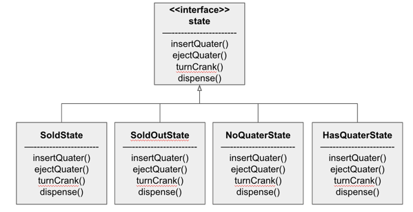
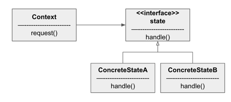

#### 객체의 상태 바꾸기 (상태 패턴)

##### 예제) 최첨단 뽑기 기계

- 상태: 동전 있음, 동전 없음, 알맹이 판매, 알맹이 매진
  - 상태값 정의
    ```java
    final static int SOLD_OUT = 0;
    final static int NO_QUATER = 1;
    final static int HAS_QUATER = 2;
    final static int SOLD = 3;
    ```
- 행동: 동전 투입, 동전 반환, 손잡이 돌립, 알맹이 내보냄
  ```java
  public void insertQuater() {
      if(state == HAS_QUATER) {
          System.out.println("동전은 한개만 넣어주세요.");
      }
      // ...
  }
  ```
  
- 상태에 따라 분기 처리가 되어야 한다
- 상태가 변경되거나 추가되면 다시 분기를 추가해야 한다

- 새로운 디자인 구상 (state pattern)

  

  - state 가 추가될 때에는 State 인터페이스를 구현한 클래스를 추가하면 된다
  - 각 상태의 행동을 별개의 클래스로 국지화하였고, 행동에 따라 상태에서 해야하는 행동을 한 후 상태를 변경해준다
    ```java
    @Override
    public void ejectQuater() {
        System.out.println("동전이 반환됩니다.");
        gumbalMachine.setState(gumbalMachine.getNoQuaterState());
    }
    ```
    
#### 상태 패턴의 정의



- 상태패턴을 사용하면 객체의 내부 상태가 바뀜에 따라 객체의 행동을 바꿀 수 있다
  - 마치 클래스가 바뀌는 것과 같은 효과를 얻을 수 있다

- 상태를 별도의 클래스로 캡슐화한 다음 현재 상태를 나타내는 객체에게 행동을 위임하므로 내부 상태가 바뀔 때 행동이 달라지게 되는 사실을 알 수 있다.

- 상태패턴과 전략패턴
  - 상태패턴을 사용할 때에는 상태 객체에 일련의 행동이 캡슐화된다
    - 상태를 기반으로 하는 행동을 캡슐화하고 행동을 현재 상태에게 위임
  - 전략패턴을 사용할 때에는 일반적으로 클라이언트가 Context 객체에게 어떤 전략 객체를 사용할지를 지정해 준다
    - 바꿔 쓸 수 있는 행동을 캡슐화한 다음, 실제 행동은 다른 객체에 위임
  