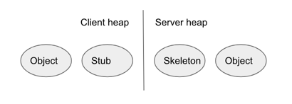
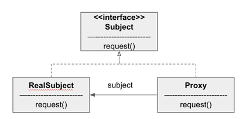
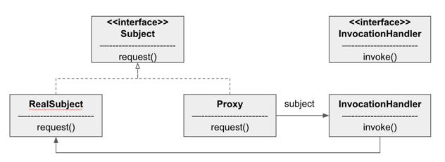

#### 객체 접근 제어하기 (프록시 패턴)

- 원격 프록시
  - 역할
    - 원격 객체의 로컬 대변자 역할
    - 다른 JVM의 힙에서 살고 있는 객체를 뜻한다

- 뽑기 기계(chap11) 업그레이드
  - GumbalMachine 에 위치를 알려주는 기능 추가
  - 해당 상태를 가져와 보여주는 모니터링 클래스 추가

- 모니터링 코드에 원격 프록시 추가하기

  
  
  - 자바 RMI 사용하여 원격 프록시 사용
  - 보조 객체에는 원격 서비스와 똑같은 메소드가 있어, 다른 환경에서 호출하더라도 로컬에서 호출하는 것과 똑같이 할 수 있게 해준다.
    - RMI에서 클라이언트 보조 객체를 STUB이라고 하고, 서버에서 보조 객체를 SKELETON 이라고 한다
  - 서버
    - 원격 인터페이스 만들기
      ```java
      public interface MyRemote extends Remote {
          String seyHello() throws RemoteException;
      }
      ```
      - java.rmi.Remote 확장
      - RemoteException 을 던지도록 선언
      - 파라미터와 리턴값은 primitive 형식 또는 Seirializable 형식으로 선언
    - 서비스 구현 클래스 만들기
      - 원격 인터페이스 구현, UnicastRemoteObject 확장(원격 객체 기능 추가 필요)
      - RemoteException 선언하는 생성자 구현
      - 서비스 RMI 레지스트리에 등록 (Naming.bind("RemoteHello", service);)
    - rmiregistry 실행 및 원격 서비스 실행하기
  - 클라이언트
    ```java
    MyRemote service = (MyService) Naming.lookup("rmi://127.0.0.1/RemoteHello");
    String s = service.sayHello();
    ```
    - RMI 레지스트리 룩업 (스텁 객체 리턴)
    - 클라이언트는 스텁의 메소드 호출
    
##### 프록시 패턴의 정의



- 특정 객체로의 접근을 제어하는 대리인(특정 객체를 대변하는 객체)을 제공
- 접근을 제어하는 프록시
  - 원격 프록시를 사용하여 원격 객체로의 접근을 제어할 수 있다.
  - 가상 프록시(virtual proxy) 를 써서 생성하기 힘든 자원으로의 접근을 제어할 수 있다
  - 보호 프록시(protection proxy) 를 써서 접근 권한이 필요한 자원으로의 접근을 제어할 수 있다.
- 원격 프록시 vs 가상 프록시
  - 원격 프록시는 다른 JVM에 들어 있는 객체의 대리인에 해당하는 로컬 객체
  - 생성하는 데 많은 비용이 드는 객체 대신하여 사용

##### 동적 프록시 만들기

- java.lang.reflect 패키지 안 프록시 기능
  
    

  - 해당 패키지를 사용하면 즉석에서 하나 이상의 인터페이스를 구현하고, 지정한 클래스에 메소드 호출을 전달하는 프록시 클래스를 만들 수 있다
  - 동적 프록시
    - 진짜 프록시 클래스는 실행중에 생성되는 것
  - InvocationHandler
    - 프록시에 호출되는 모든 메서드에 응답한다.
    - Proxy 에서 메서드 호출을 받으면 항상 InvocationHandler 에 진짜 작업을 부탁한다

- 예제) 객체마을 데이팅 서비스
  - 서로 상대방의 괴짜 지수를 매기는 기능(rating)을 더해 더 좋은 상대를 만들어주기로 함
  - Person interface 와 PersonImpl 구현체 구현
  - 다른 고객의 정보를 마음대로 바꾸는 것을 막기 위해 Person 인터페이스를 지금처럼 두면 클라이언트에서 메소드를 마음대로 호출할 수 있다.
    - 이 때, 보호 프록시를 사용
  - 보호 프록시는 접근 권한을 바탕으로 객체로의 접근을 제어하는 프록시
  - 동적 프록시 만들기
    - 1단계: 2개의 InvocationHandler 만들기
      - 하나는 본인용 핸들러, 다른 하나는 타인용 핸들러
      - 프록시 호출(proxy.setGeekRating(9);) -> InvocationHandler 호출(invoke(Object proxy, Method method, Object[] args);)
      - 핸들러에서는 주어진 요청을 어떻게 처리할 지 결정한 다음 상황에 따라 RealSubject에 그 요청을 전달 할 수 있다.
        - return method.invoke(person, args);
    - 2단계: 동적 프록시 생성 코드 만들기
      - 동적으로 프록시 클래스를 생성하는 프록시 객체 인스턴스 생성 필요
        ```java
        Person getOwnerProxy(Person person) {
            return (Person) Proxy.newProxyInstance(
                person.getClass().getClassLoader(),
                person.getClass().getInterfaces(),
                new OwnerInvocationHandler(person);
            );
        }
        ```
        - 해당 메소드는 Person 객체(진짜 주체) 를 인자로 받아오고 프록시를 리턴
        - java.lang.reflect 에 Proxy 를 통해 새로운 프록시 인터페이스를 받음
        - 클래스 로더, 인터페이스, 호출핸들러(OwnerInvocationHandler)를 인자로 전달 필요